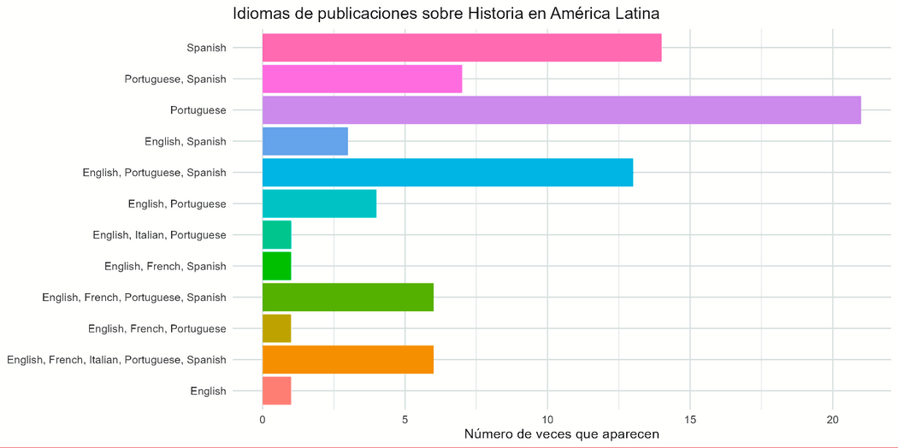
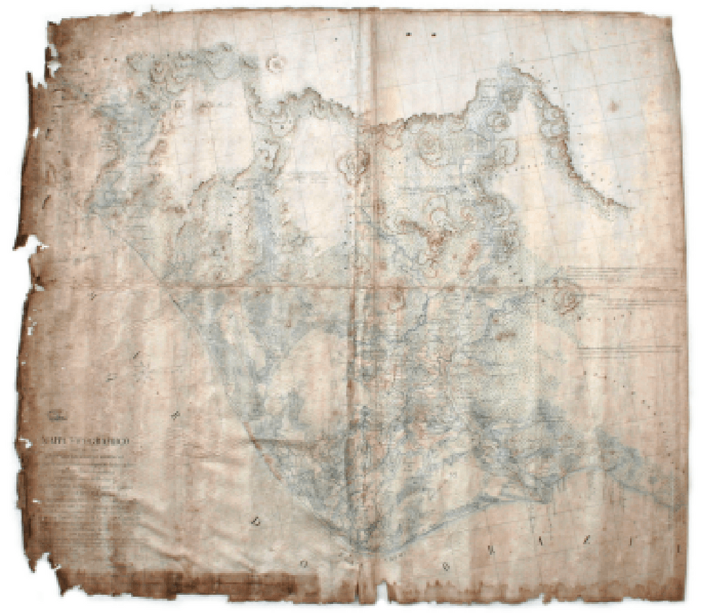
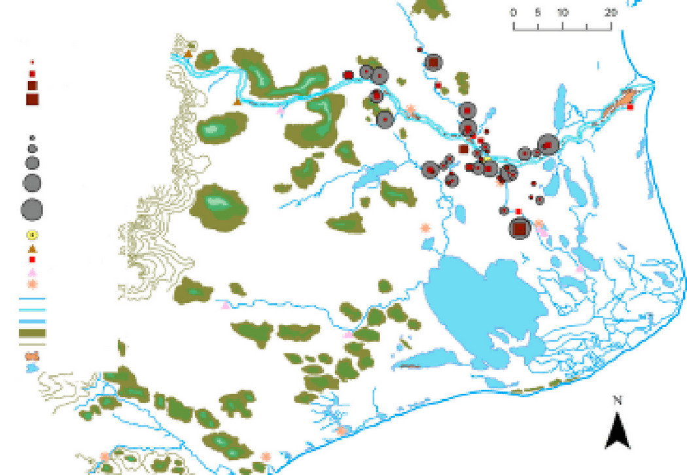
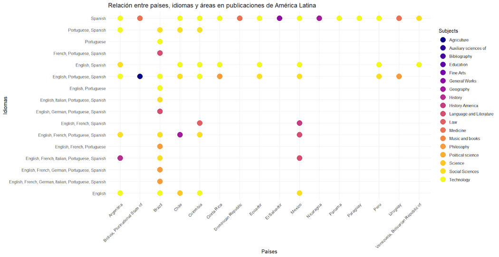
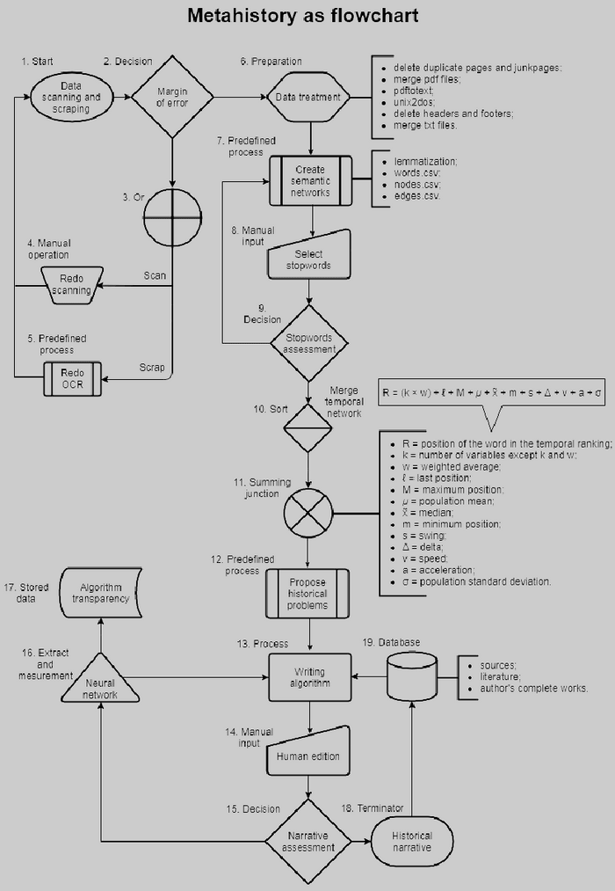

**La Historia y la invasión de la tecnología, una revisión de la Historia Digital en América Latina**

**_History and the Invasion of Technology, a Review of Digital History in Latin America_**

[Romina De León](mailto:romideleon@gmail.com)

IIBICRIT - HD LAB (CONICET) - UNTREF

[https://orcid.org/0000-0003-2495-7213](https://orcid.org/0000-0003-2495-7213)

**RESUMEN**

Desde la mitad del siglo XX el avance tecnológico ha ocurrido a pasos colosales, las herramientas digitales comenzaron a atravesar en todos los ámbitos académicos, y las Humanidades y Ciencias Sociales no fueron la excepción. En los últimos 20 años la Historia, en general, y a los historiadores en particular, no fueron ajenos a los cambios, por lo cual, han comenzado a aggiornarse con las tecnologías. Muchos estudiosos han comprendido que los saberes digitales podrían ser una nueva opción metodológica, fomentando nuevas o reinventadas formas de razonar, investigar y escribir. Es por ello, que en este trabajo se buscará realizar una sucinta revisión sobre la Historia Digital en la región latinoamericana.

**PALABRAS CLAVE:** Historia digital, Humanidades Digitales, Recuperación de la información, América Latina, revisión de literatura.

**ABSTRACT**

Since the mid-twentieth century technological progress has occurred in colossal steps, digital tools began to penetrate all academic fields, and the Humanities and Social Sciences were no exception. In the last 20 years History in general, and historians in particular, have not been strangers to changes, and have begun to update themselves with technologies. Many experts have understood that digital knowledge could be a new methodological option, promoting new or reinvented ways of reasoning, researching, and writing. For this reason, this work will seek to carry out a succinct review of digital history in the Latin American region.

**KEYWORDS:** Digital History, Digital Humanities, Information Retrieval, Latin America, Literature Review.

1. **INTRODUCCIÓN**

Durante la década de 1950, los humanistas emprendieron los primeros pasos en la investigación computacional orientada a las Humanidades. Este desarrollo englobó la significativa visita del padre Roberto Busa a la Universidad de Yale en 1956, quien durante más de un decenio había estado dedicado a trabajar en dicha intersección disciplinaria. En septiembre de 1964 se realizó la primera conferencia sobre computadoras y Humanidades, _Literary Data Processing Conference_ organizada por Harry F. Arader de International Business Machine (IBM) y precedido por Stephen Parrish de Cornell y Jess B. Bessinger de la Universidad de New York. Esta tuvo como objetivo informar sobre el procesamiento de datos literarios, y por ello, la presentación del padre Busa refirió a la problemática de trabajar con más de 15 millones de palabras en su índice verbal de los escritos de Santo Tomás de Aquino. Por otro lado, varios expositores, entre ellos los organizadores, explicaron los esfuerzos en generar concordancias con esas inmensas y primitivas computadoras (Raben, 2007). Ese mismo año, se estableció _Literary and Linguistic Computing Centre_, en la Universidad de Cambridge. Inicialmente fue un pequeño grupo del servicio de computación que ofrecía soporte informático a los departamentos de Arte y Humanidades (Lieb, 1966).

En 1965 se formó el primer centro orientado a las investigaciones informáticas en Humanidades, _Institute for Computer Research in the Humanities_ en la Universidad de New York[^1]; también durante ese año, en la Universidad de Yale, se realizó la conferencia _Computers for the Humanities?_ con la subvención de IBM. Allí se presentaron charlas y un panel de discusión sobre diversos temas, desde historia al funcionamiento de las computadoras, así como de aplicaciones informáticas en lingüística, biblioteca, literatura, música y ciencias sociales, entre otras (Leeds, 1966; Norman, s.f.). Estos fueron algunos precedentes de las _Humanities Computing_, donde los humanistas interesados en la utilización de computadoras podrían abordar computacionalmente sus objetos de estudio.

Los avances continuaron en el ámbito norteamericano[^2] con la publicación de revistas sobre el tema. Ejemplo de ello sería _Computers and the Humanities,_ con vigencia desde 1966 hasta 2004. Durante ese último año, la disciplina encontró su denominación final, _Digital Humanities_ (DH). Mientras que, en el ámbito de habla hispana, el camino fue un tanto más lento, bajo la identidad inicial de Informática Humanística (Lucía Megías, 2003). En 1986, en Berlín, se convocó la primera sesión extraordinaria sobre "Hispanismo e Informática"[^3] en el Congreso de la Asociación Internacional de Hispanistas. Ese mismo año se publicaba también el trabajo de Francisco Marcos Marín (1986), en la revista _Incipit_, sobre una metodología informática para la edición de textos (del Rio Riande y Allés Torrent, 2018). Finalmente, se formalizaron las Humanidades Digitales (HD) en México en 2011 con la conformación de la RedHD[^4], dos años más tarde se establecieron la Associação das Humanidades Digitais de Brasil[^5] y la Asociación Argentina de Humanidades Digitales[^6].

Ahora bien, la definición de las HD o DH ha sido un camino sinuoso, si bien se conceptualizó primero en la región angloparlante, hoy día continúa sin lograr consenso en su delimitación[^7] (del Rio Riande, 2014).

Por ende, se pueden definir como la convergencia de las Ciencias Humanas y Sociales con la Informática, con el fin de desarrollar investigaciones, aplicaciones, construcciones digitales, etc. Además, las HD promueven el trabajo entre comunidades que incorporen metodologías, herramientas y objetivos interdisciplinarios; en ese sentido, coexisten áreas que se relacionan con el uso de dichos medios específicos.

Una de estas áreas es la Historia Digital, que se puede entender, en términos generales, como las tareas tradicionales de un historiador (investigar, proporcionar conocimiento, conservar y analizar fuentes históricas, y enseñar a pensar de manera crítica e histórica), pero con la mediación de tecnologías informáticas, internet y numerosos softwares. Estos quehaceres permiten la generación de producciones y comunicaciones académicas, así como el desarrollo de materiales didácticos y la recopilación de datos científicos (Gallini y Noiret, 2011). Incluso, si se considera el enfoque metodológico, la Historia Digital utiliza la capacidad hipertextual de las tecnologías para _digitalizar_ el pasado. Sin embargo, esta disciplina no debería acotarse únicamente a la digitalización, pues su perspectiva admite conjuntamente, documentar, analizar y representar lo acaecido, y el presente en su _continuum_ histórico, a través de las tecnologías de información y de la comunicación (Cohen y Rosenzweig, 2006; Bocanegra Barbecho y Toscano, 2022).

En esta revisión, es fundamental considerar la Historia Digital, sus desarrollos y aplicaciones en América Latina, ya que se destaca que los avances en las Humanidades Digitales y disciplinas relacionadas han estado desfasados en comparación con regiones como Estados Unidos, el norte y oeste de Europa. Esto se refleja inclusive en la diferenciación entre las comunidades académicas anglo e hispanoparlantes en el área de interés. Empero, no es una exclusividad de las HD, pues en numerosos estudios se ha expuesto que el idioma se encuentra "asociado con desventajas en el acceso" a la información científica, y en la definición de una relación "centro-periferia"[^8] en la producción de conocimiento científico (Priani Saisó et al., 2014), p. 6. Aún más se observa que países como España, Brasil, Portugal, México, Argentina, Chile y Colombia conforman una sub-red con mayor tendencia a generar colaboraciones entre sí, que con el resto de Europa o los Estados Unidos (pp. 6-7).

Por todo ello, esta revisión buscará presentar una sucinta muestra de bibliografía referida a la Historia Digital, en diversos repositorios, bases de datos y buscadores, desarrollada o publicada en la región latinoamericana.

2. **LA EVOLUCIÓN DE LA HISTORIA DIGITAL EN AMÉRICA LATINA: AVANCES Y DESAFÍOS**

En la región latinoamericana la Historia Digital aún no presenta gran reconocimiento o interés por parte de generaciones anteriores[^9] a la era digital[^10]. Gayol y Melo Flórez (2017) explican que en la década del 70 se entendía a la computación como una herramienta imprescindible en el futuro de los historiadores, sin embargo, actualmente muchos de ellos continúan sobreviviendo sin utilizar tecnologías en sus investigaciones. En consecuencia, se puede observar a partir del nuevo siglo y con el avance tecnológico, la fisura existente entre los campos académicos tradicionales y la realidad cultural representada mediante nuevas tecnologías de información y de comunicación. Es decir que este avance atravesó todas las disciplinas, incluso en las Humanidades, sin que sea excepción la Historia. Por lo cual, durante una entrevista Anaclet Pons asegura que "el mundo digital desordena todo el mundo anterior, lo desordena todo: el mundo de la historia, el mundo del archivo, el mundo de la política, el mundo del periodismo, lo desordena todo" (Taroncher, 2019).

De esta forma, se puede comprender que, con la consolidación del ámbito digital, las y los historiadores comenzaron a utilizar herramientas y metodologías de las HD, pues han percibido la gran potencialidad que estas pueden otorgarles a sus investigaciones. Sin embargo, para historiadores más conservadores, se perpetúa la poca amistad para con dichas incorporaciones, no sólo por la utilización de diferentes softwares, sino por los enfoques que deben considerarse. Se añade a esto, la ya mencionada disparidad en el avance académico como consecuencia de los desiguales procesos históricos, sociales y económicos en el mundo (Topuzian, 2013).

En ese marco, se han realizado sondeos en distintos repositorios sobre la Historia Digital buscando referenciar las diferencias regionales e idiomáticas en el ámbito latinoamericano en forma comparativa. Anteriormente, Nicolás Quiroga (2018a) realizó aproximaciones respecto al trabajo de historiadores con relación a buscadores académicos, expresando cómo las nuevas tecnologías, desde los años 90, han permeado las investigaciones. A la par, reflexionando respecto al trabajo de archivo, explica la transición de lo manuscrito hacia lo digital. Esto se produce, aun cuando, en el ámbito educativo, particularmente en los niveles superiores, no se han incorporado instancias de aprendizaje y discusión de la Historia Digital. Por ello, considera que "en el futuro, el mundo de la vida irá _guardándose_ cada vez más en archivos digitales y tendremos que problematizar, cada vez más y mejor, la relación entre textos, archivos y escritura" y continúa ponderando la necesidad de promover la alfabetización digital y el compromiso frente a los cambios sociales (p. 207). De manera análoga, Bocanegra Barbecho y Toscano (2022) proponen que, esta _nueva_ forma de _historiar_, requiere la incorporación de métodos, incluso de otras disciplinas, que impliquen una continua experimentación, adaptándose a las necesidades de los objetivos de cada investigación histórica o de los corpus documentales (pp. 10-11).

Cabe destacar, el desarrollo de la Historia Digital en Estados Unidos se inició en distintas universidades a finales de los años 90, con grandes proyectos que aplican metodologías que van desde la digitalización hasta procesamientos y obtención de datos, inclusive se han creado centros de investigación temáticos. De manera similar, ha sido destacada la labor en países europeos del norte y oeste, particularmente en Reino Unido a principio de los 2000, así como pequeños proyectos o investigaciones en España e Italia, que fueron profundizándose, hasta llegar, en los últimos años, a la publicación de dossiers y revistas sobre el tema. En el aspecto educativo, en la mayoría de los países de las regiones mencionadas, han avanzado con asignaturas, seminarios y cursos sobre Historia Digital.

En América Latina comenzó un lento desarrollo cruzando la primera década del siglo actual (Eiroa, 2018; Prado, 2021; Bocanegra Barbecho y Toscano, 2022), con una gran disparidad, revelada al realizar búsquedas académicas en distintos repositorios, bases de datos y archivos. En palabras de Priani et al. (2014), la emergencia de las HD (y a la Historia Digital por su relación directa con estas), en nuestra región, está marcada por la heterogeneidad, las diferencias lingüísticas y regionales, así como también por sus prácticas y metodologías (pp. 8-9). Estas cuestiones evidenciaron la necesidad y relevancia que implicaría un relevamiento bibliográfico sobre la Historia Digital durante los últimos años en Latinoamérica. Pues, también, permitiría considerar el desarrollo de la Historia Digital en el área, su lugar dentro de las HD, y explorar las diferencias y similitudes de las producciones historiográficas.

Con el fin de asegurar la solidez y pertinencia de este trabajo, se emprendió la construcción de un corpus a partir de exhaustivas búsquedas bibliográficas en diversos repositorios y bases de datos de renombre. Este proceso se rigió por criterios específicos, pues los artículos seleccionados no solo deben abordar la Historia Digital, sino que también deben adoptar una perspectiva que trascienda la mera digitalización de fuentes. Aún más, se espera que estos documentos ofrezcan metodologías innovadoras y propuestas concretas relacionadas con herramientas digitales.

En el próximo apartado, se detallará meticulosamente la metodología empleada, desglosando cada uno de los filtros aplicados en el proceso de selección. Este enfoque garantiza que el corpus sea no solo relevante, sino también representativo de la vanguardia en la intersección de la Historia Digital y las herramientas digitales. Cada artículo incluido se ha escogido con el objetivo de enriquecer y aportar profundidad a nuestra comprensión del panorama actual de la Historia Digital en América Latina.

3. **SELECCIÓN DEL CORPUS**

**3.1. Metodología de búsqueda**

La búsqueda de los documentos revisitados en este estudio se llevó a cabo con meticulosidad, considerando varios aspectos clave: el objeto de interés, que es la Historia Digital; el área de análisis, que abarca América Latina, en lo que respecta a instituciones, subsidios y autores; la condición indispensable de que los documentos fueran artículos de investigación con resumen y palabras clave; la revisión por pares; la restricción temporal a publicaciones de los últimos cinco años. Además, se excluyeron deliberadamente aquellos relacionados con Ciencias de la Educación, pues el enfoque de este análisis se centra en cómo las tecnologías se incorporan en la labor de historiadores como investigadores y no como docentes. Cada uno de estos filtros se pensó con el objetivo de generar un corpus[^11] que cumpliera con el propósito central de este artículo.

Se utilizaron diversos sitios en el proceso, tales como EBSCO (Elton B. Stephens Company)[^12], LA Referencia[^13], SciELO[^14], Google Scholar[^15], Internet Archive Scholar[^16], Academia[^17] y ResearchGate[^18]. Cada uno de estos recursos, con sus pros y contras, contribuyó a la obtención de resultados que fueron evaluados, incluyendo aquellos que, por razones específicas, se descartaron tras un análisis detenido. En cada formulación de búsqueda, se concedió importancia a los tesauros y descriptores disponibles en los sitios que los proporcionaban, subrayando, con lo anterior, la atención meticulosa dada a cada paso de este proceso.

Los resultados obtenidos revelan que LA Referencia y SciELO fueron los buscadores que proporcionaron los resultados más pertinentes para la región. Mientras que Google Scholar y EBSCO presentaron principalmente artículos relacionados con Europa y/o Estados Unidos, y mayoritariamente en inglés. Asimismo, es crucial resaltar la preponderancia de trabajos en portugués originarios de diversos institutos y universidades en Brasil, no solo por su cantidad, sino por el respaldo presupuestario en dicha área. Esta tendencia se ilustra en el siguiente gráfico.

Figura 1. Cantidad de publicaciones en Historia en América Latina, sobre la base de datos abiertos publicados en Directory of Open Access Journals (DOAJ)[^19]. Fuente: Elaboración propia.

Cómo punto final sobre las búsquedas es importante señalar que las redes académicas, aún con su preeminencia en los resultados en Google[^20], presentan grandes limitaciones. Estas plataformas, al ser de acceso pago, imponen restricciones considerables que no permiten cotejar la cantidad de trabajos, realizar exploraciones más específicas y agregar filtros adicionales.

**3.2. Resultados de búsqueda**

El corpus provisto en las exploraciones en distintos sitios tuvo las consideraciones mencionadas en el apartado anterior, asimismo a continuación se enumerarán los pasos seguidos en cada web.

La primera en que se trabajó fue en la base de datos EBSCO[^21], realizando una primera formulación en el área _Academic Search Complete_, posteriormente dentro del tesauro/descriptores se ingresaron los términos _History_ y _Digital Humanities_, finalmente se añadió el objeto de interés _Digital_ _Distory_. Se sumaron los filtros respecto a fecha de publicación, textos completos en línea y publicaciones arbitradas, sin embargo, esta formulación no arrojó resultados[^22]. Por lo cual, modificando los conectores lógicos, se obtuvieron 12 resultados[^23]. A continuación, se limitaron los artículos únicamente relacionados a la Historia Digital, particularmente cuando el término se encuentra presente en palabras clave o en el título, y además debían poseer formato de artículo académico, es decir que incluyeran resumen y palabras clave. Finalmente devolvió sólo un trabajo acertado a los intereses de esta revisión, el de Pires y Amorim (2021).

Otra base de datos que se analizó fue SciELO, donde la búsqueda se realizó en español, considerando el objeto de interés y las mismas categorías disciplinares anteriores, así como los filtros mencionados. Esta arrojó 10 resultados, de los cuales solo uno fue pertinente, puesto que otros ya se habían obtenido en otros sitios o no pertenecían a la región examinada o al recorte temático[^24]. El artículo pertenece a Porto Da Gama y Valencia Villa (2018).

Las exploraciones en repositorios se efectuaron en LA Referencia, el objeto de interés _Historia Digital_, restringido a países latinoamericanos, artículos, capítulos de libros e informes técnicos. Se revelaron 30 resultados, por lo cual se filtraron los que tuviesen el término dentro de título o palabras clave, y que incluyeran resúmenes y palabras clave[^25]. Además, se descartaron los que poseían financiación de otras nacionalidades, y que se alejaban de la Historia como disciplina, cómo los relacionados a TICs o métodos de enseñanza[^26]. El subcorpus estuvo compuesto por Nicodemo y Cardoso (2019), Laitano (2020), Ferla et al. (2020), Rodrigues (2020), Ribeiro et al. (2020), Brasil y Nascimento (2020), Brasil (2022), Quiroga (2022).

El buscador académico que se utilizó fue Google Scholar, la indagación se inició sólo con el objeto de interés, arrojando más de mil resultados, aún al estar limitada desde el año 2019. Paso siguiente, se realizó una reformulación agregando operadores lógicos, _Humanidades Digitales_ e _Historia_, asimismo devolvió más de cien trabajos. Sin embargo, al utilizar la herramienta _búsqueda avanzada_ y limitar que _Historia Digital_ figure únicamente en el título, evitando los resultados masivos, se pudo limitar a 50 artículos. Desde allí se continuó con un filtrado manual, obteniendo solo cuatro trabajos pertinentes de la región analizada, relativos a las Humanidades o Ciencias Sociales, y con características análogas a un trabajo académico[^27]. Estos fueron, Quiroga (2018b, 2021), Fernández (2019) y Nieto (2021).

Posteriormente, se trabajó en Internet Archive Scholar. En las diferentes búsquedas, este sitio no arrojó resultados que pertenecieran a las disciplinas mencionadas, o que no hubiesen figurado ya en los buscadores previos[^28].

Por último, se realizaron exploraciones en dos redes académicas, Academia y Research Gate. La primera obliga a poseer una cuenta paga para poder realizar filtrado, por ello al insertar la formulación genera miles de resultados lo que resulta de, lo que resulta de poca utilidad. Asimismo, los primeros trabajos visibles pertenecían a la academia española, otros no se ajustaban al tiempo de recorte y, algunos títulos no eran afines a las pretensiones de este trabajo, por ende, se descartaron. Al analizar Research Gate, tampoco devolvió resultados convenientes, pues el sitio no permite hacer filtrado, además la barra de búsqueda es muy escueta, sólo pueden añadirse hasta tres operadores lógicos y acepta el uso de comillas[^29].

4. **PRODUCCIÓN POR IDIOMAS**

**4.1. Español**

En la región latinoamericana la producción sobre Historia Digital publicada en español se encuentra ligada fuertemente a las Humanidades Digitales, la mayoría de los trabajos revisados evidencian una relación directa.

Quiroga (2018b, 2021, 2022) ha explorado nuestro objeto de interés desde 2011, cuando emprendió las primeras inclusiones de tecnología en metodologías tradicionales del quehacer histórico. Su primera publicación revisitada se remonta a 2018, en el segundo volumen de la _Revista de Humanidades Digitales_[^30], donde aborda el "escritorio del historiador" como un ecosistema sociotécnico (p. 34). Allí destaca la necesidad de conocimientos tanto historiográficos como tecnológicos para aprovechar las herramientas digitales. Por ello plantea cómo estas nuevas formas no contradicen los procesamientos tradicionales de datos, sin embargo, subraya que debe deliberarse sobre la implicancia que dichas tecnologías tienen en las operaciones sobre categorías históricas y analíticas en las investigaciones.

En un trabajo más reciente, incluido en el dossier del anuario _Vegueta_[^31] sobre Historia Digital, Quiroga (2022a) busca "informar sobre problemáticas conceptuales, metodológicas y prácticas surgidas en el trabajo con fuentes nacidas digitales" (p. 40). Para ello, realiza una exploración de dos escenarios específicos. Por un lado, trabaja en los registros conversacionales de Bulletin Board System (BBS)[^32] para estudiar la sociabilidad de esa subcultura (los usuarios en línea por medio de esa tecnología), y por otro, se pregunta a partir de los datos masivos de Geocities.com[^33], sobre las herramientas que proponen minería de textos y lectura distante[^34]. Por consiguiente, concluye que estas dos experiencias habilitan, por medio del análisis y la interacción con tecnologías obsoletas, la comprensión de las temporalidades digitales, además Quiroga añade que "con colecciones como Geocities.com, sobre las que no podemos tener una visión de conjunto, no es suficiente el uso de herramientas computacionales: tenemos que adentrarnos en la vida de los algoritmos" (p. 52). El autor destaca que los objetos estudiados junto a su experimentación y la transformación de sus subculturas mediante tecnologías contemporáneas, así como la exploración de documentos nacidos digitalmente, condujeron a diálogos sobre los cambios en páginas web y colecciones digitales. En suma, estas conversaciones abrieron paso a "una indagación sobre los algoritmos (y sus conexiones) que integran las técnicas de las humanidades digitales" (p. 52) así como la ayuda de la crítica textual (más precisamente a la crítica de la crítica) para los contenidos digitales. Por lo cual, Quiroga concluye que su propuesta, con el relevamiento de estas dos perspectivas, halló una forma de avanzar hacia la "comprensión de sus _affordances_ y de los complejos sociotécnicos donde se construyen: una preocupada por comprender las tecnologías y la otra por criticar las técnicas" (p. 52).

El último trabajo de este investigador argentino arrojado por la búsqueda fue la presentación que realizó en el dossier "Temas y problemáticas de la Historia Digital en Argentina, 2022" del _Anuario_. _Escuela de Historia_ publicado por la Universidad de Rosario[^35]. Entonces, Quiroga (2022b) esquematiza un sucinto recorrido por la Historia y el uso de las computadoras, expresando que la Historia Digital posee:

> definiciones [que] abundan, pero tienen en común [la interpretación histórica y las tecnologías digitales] dos movimientos realizados al mismo tiempo: tratar de abarcar la mayor cantidad de objetos digitales y sus relaciones con la disciplina, y a la vez posicionarse con respecto a las Humanidades Digitales (p. 1).

Asimismo, considera que como metodologías se le han sumado "métodos (minería de textos y georreferenciación, especialmente), formas de presentación de resultados, nuevos géneros de escritura y nuevos modos de enseñanza, transformaciones en el archivo y en la materialidad de las fuentes" (p. 2). También señala que el giro digital ha generado mutaciones mediante el avance de la tecnología convirtiendo el "futuro del pasado". Respecto al dossier[^36] destaca que, no es un reflejo real de producciones argentinas, puesto que el avance de la Historia Digital se retrotrae al menos 10 años. Primero como área emergente relacionada a las metodologías de las Humanidades Digitales, y luego como productora de ideas sobre archivos, trabajo con fuentes nacidas digitales, así como con metodologías relacionadas a la visualización de datos y el uso de tecnologías digitales por docentes e investigadores.

Otro historiador argentino que ha explorado el tema es Agustín Nieto (2021). Sus desarrollos han ido acompañados de análisis metodológicos mediante diversos lenguajes de programación, como R y Python[^37], para poder realizar una lectura escalable[^38], que difiere de la lectura distante y cercana, de publicaciones periódicas en busca de conflictividad social en diferentes oficios y gremios de Mar del Plata, ciudad costera argentina. En consonancia con esto, Nieto argumenta que el enfoque histórico en ejercicios de lectura distante para el análisis de la conflictividad social es virtualmente inexistente. Este vacío se atribuye, en primer lugar, al predominio de enfoques cualitativos en el tratamiento de los documentos históricos. Además, la dicotomía entre cualitativo y cuantitativo en este tipo de fuentes resulta insostenible, ya que ambos enfoques son totalmente complementarios.

En México, el desarrollo de la Historia Digital se constituye en un área de estudio muy incipiente que ha crecido lentamente. Iñigo Fernández (2020) recalca la labor de su coterráneo, Víctor Gayol colaborador en _The Programming Historian_[^39]. Este es un sitio web con tutoriales para la enseñanza de herramientas y técnicas de las Humanidades Digitales. Asimismo, señala que la marginal presencia de la Historia Digital en el campo profesional es una conjunción de factores, en los ámbitos epistemológico, por la poca difusión en el país; formativo, debido a la cuestión generacional; y tecnológico, por el uso de software en inglés, por no contar con desarrollos propios, así como por el escaso conocimiento en Lingüística y los altos costos de adquisición de equipos adecuados. Por todo lo anterior, Fernández concluye que en su país los problemas puntuales para el ejercicio de la Historia Digital van desde las condiciones económicas del país hasta la formación de las/los historiadores, con problemáticas que abarcan políticas públicas y brechas generacionales, entre otras. A la par, añade que pueden surgir oportunidades en particular, en lo que respecta a la formación de recursos humanos, no sólo en las nuevas generaciones, sino en la difusión de trabajos para las más tradicionales.

El último trabajo en español que devolvió la búsqueda fue de dos historiadores de universidades brasileñas, Porto Da Gama y Valencia Villa (2018), que publicaron en _Fronteras de la Historia_ editada por el Instituto Colombiano de Antropología e Historia (ICANH). Allí expusieron las emergentes asociaciones que se realizan desde la Historia, transfiriendo y traduciendo fuentes con la incorporación de sistemas de información geográfica (SIG) a la investigación histórica. Esto se tradujo en la georreferenciación del mapa topográfico de Manoel Martins de Couto Reis[^40], si bien los _Manuscritos_ de dicho cartógrafo se utilizaron en diversas investigaciones previas, no fue así el caso de los mapas, pues hasta este momento no se había relevado la información geográfica. Porto Da Gama y Valencia Villa consideran que no se utilizaban porque "su incorporación no traería nada importante al análisis" (p. 92), pero que, en los últimos años, la evaluación del espacio como variable amplió la capacidad de comprender los procesos históricos.

 

Figura 2. A la izquierda, Mapa topográfico do distrito de Campos dos Goytacazes de M. Couto. A la derecha mapa georreferenciado y vectorizado realizado por los autores. Elaboración: Porto da Gama y Valencia Villa (2018, pp. 95-108).

Estas imágenes representan, por un lado, la utilización de esta fuente primaria y por el otro, el proceso llevado adelante por Porto da Gama y Valencia Villa que implicó la reorientación, la variación de escala y verificación de puntos de control para lograr la georreferenciación de cada espacio y su consecuente vectorización, es decir traducir gráficamente y con referencias espaciales los elementos representados por Couto Reis. De esta manera, visibilizan como los sistemas de información geográfica como método de investigación son relevantes para la Historia en general (p. 110).

4.2. **Portugués**

Las publicaciones en portugués representan el mayor avance en Historia Digital en América Latina, traducido en la cantidad de publicaciones que arrojaron las búsquedas realizadas.

El primero pertenece a Ribeiro, Sales, Nascimento y Fortes (2020), quienes evalúan la experiencia del Centro de Documentação e Imagem (Cedim) de la Universidade Federal Rural do Rio de Janeiro (UFRRJ), añadiendo importancia en el estudio de los movimientos sociales de la región. Los autores señalan que la Historia Digital permite la inserción de voces subalternas suprimidas en las nuevas narrativas de largo plazo viabilizadas por la tecnología digital. De esta manera, luego de un minucioso detalle sobre la formación, la digitalización, así como sobre la historia local del centro de documentación, refiere a las desigualdades que aún imperan en la Historia Digital, por un lado, por el papel predominante de la lengua anglosajona, y por otro, por la hegemonía de las grandes corporaciones tecnológicas, aun cuando han referido al uso de licencias abiertas.

Por su parte, Ferla et al. (2020) emplearon metodologías colaborativas y de código abierto en la creación de una cartografía histórica de São Paulo, denominada Paulicea 2.0[^41]. Además, utilizaron este proyecto como un caso de estudio para explorar las interacciones entre las tecnologías digitales y la labor del historiador. Como trabajo conjunto entre desarrolladores e historiadores, se llevó adelante el mencionado "geolocalizador do passado", adaptado a dicha ciudad entre 1870 y 1940 (p. 1210). Los autores afirman que este proyecto representa una articulación entre conocimiento historiográfico y computacional, acomodándose entre las exigencias de las máquinas y la ambigüedad del pasado (p. 1211). En consecuencia, sostienen que, considerando el estado actual de las Humanidades Digitales en Brasil, el intercambio de perspectivas y los conhecimentos derivados de iniciativas pioneras podrían ser fundamentales para abordar los desafíos involucrados. A esto se suma, además, el apoyo de la ética en ciencia abierta, donde no solo es beneficioso compartir resultados, sino también enfrentar problemas y compartir soluciones que precedieron.

El trabalho de Pires y Amorim (2021) ha buscado analizar la profesión del historiador al trabajar con fuentes y repositorios digitales, para ello utilizaron el repositorio de la revista _Pour l'Ère Nouvelle_, durante la pandemia del 2020-2021, momento en que era imposible acceder a archivos físicos. El análisis de dicho repositorio tuvo como objetivos evaluar, en primer lugar, las influencias de escuelas de pensamiento extranjeras en la construcción de la educación nacional brasileña y cómo las nuevas configuraciones de colecciones virtuales representan cambios en la propia Ciencia Histórica respecto a la disposición, materialidad, autenticidad de documentos, entre otros. Finalmente, entienden que la posibilidad de consultar virtualmente fuentes históricas en repositorios, instituciones y/o acervos permite que algunos aspectos puedan ser más problematizados y/o revisados con el surgimiento de nuevas informaciones y datos.

Otro trabajo sobre archivos fue publicado por Brasil y Nascimento (2022) reflexionando sobre la Hemeroteca Digital Brasileña (HDB) y el uso de CAQDAS[^42], es decir el papel de las herramientas digitales, y el avance del uso de fuentes de investigación de colecciones y repositorios digitales. En ese tenor, destacan que el trabajo de los historiadores frente al archivo digital no dista del físico, porque requiere el mismo rigor metodológico en el tratamiento de la fuente sea o no digital. Por ello, buscaron enumerar problemas y estrategias metodológicas de la práctica historiográfica en formato digital, mediante una búsqueda ejemplo, proponiendo las posibilidades que surgen del uso de la HDB. Por lo cual, resaltaron que la indagación y este tipo de fuentes posibilitaron la formulación de preguntas y objetivos innovadores, así como la generación de respuestas inéditas que de otro modo hubieran sido impensables. Por ende, tanto la hermenéutica como la epistemología de la Historia experimentaron alteraciones significativas.

En 2022, Eric Brasil actualizó el trabajo anterior y desarrolló la librería pyHDB[^43] en Python. Se trata de una herramienta heurística para auxiliar a investigadores que utilicen el acervo de la HDB, potenciando así, el tratamiento y análisis de las fuentes digitalizadas, y la transparencia metodológica en el momento de presentar resultados. Esta librería recoge datos de internet, por medio de _web scraping_[^44], a partir de parámetros definidos por el usuario en la interfaz de la HDB. Por lo cual, el autor señala que tanto las herramientas digitales como los métodos, se encuentran arraigados en la teoría, impactando en los resultados epistemológicos. Entonces acentúa las posibilidades que presenta su implementación en relación con el uso de técnicas de análisis o de visualizaciones que pueden efectuar los investigadores.

Aldair Rodrigues (2020) se enfocó en la población esclavizada de Mariana, Minas Gerais, Brasil, durante el siglo XVIII. Su objetivo principal fue explorar los desafíos y alcances de trasladar información histórica de documentos producidos en un contexto atravesado por relaciones de poder esclavistas a sistemas digitales. Este proyecto fue llevado adelante por el Departamento de Historia de la Universidad Estadual de Campinas. Se emplearon cuatro núcleos de información que abarcaron archivos notariales, fiscales, carcelarios e inquisitoriales, con el objetivo de profundizar en las trayectorias de vida de estas personas desde diversas perspectivas. Hasta finales de 2019, se habían recopilado alrededor de 10 mil registros, pero se planeaba aumentar este número y posteriormente publicar los datos en el sitio del Instituto de Filosofía y Ciencias Humanas (IFCH)[^45].

Aunque la meta principal fue la creación de una base de datos con las características mencionadas, el proyecto también provocó debates sobre ética y _big data_[^46], particularmente en el ámbito de la Historia Digital. Se debe subrayar que la producción histórica siempre está influenciada por relaciones sociales tanto del pasado como durante su elaboración, por lo cual, proyectos de este tipo generan _significados_ específicos. Rodrigues expresa que las potencialidades de las herramientas de _big data_ pueden llevar a la subestimación en la acción histórica, y a la exclusión de las voces de sujetos marginados, pues la codificación en variables puede configurarlos como simples productos académicos desde miradas racializadoras.

En este punto, el autor realiza un llamado a la construcción de bases de datos que impliquen una crítica documental, especialmente considerando el contexto esclavista. Lo anterior involucró reflexiones sobre las dinámicas subyacentes en la constitución de su corpus. Por lo cual, se incluyeron procesos de empadronamiento, nomenclaturas originarias de etnias africanas, variaciones ortográficas, desambiguación de datos onomásticos, etc., que promovieron superar una imagen genérica y racializada del continente africano y su historia. Por ello, Rodrigues concluye que fomentar este tipo de producciones es una poderosa estrategia para combatir los impactos del racismo estructural y los efectos que este reproduce en el campo epistemológico.

El último artículo que trajo la búsqueda fue el de Grigoletti Laitano (2020) en el dossier _História global e digital: novos horizontes para a investigação histórica_[^47] de la publicación _Esboços: histórias em contextos globais_[^48]. El autor analiza y reflexiona sobre prácticas y metodologías que fueron incorporadas por los historiadores en la era digital. Advierte, además, sobre las oportunidades y desafíos que ello representa, destacando la necesidad de actitudes reflexivas y abiertas hacia los avances y transformaciones tecnológicos dentro de las Humanidades.

**4. 3. Inglés**

La producción académica en inglés en la región se limita principalmente a temas relacionados con tecnología y ciencias, que abarca las áreas de Ciencias Naturales y Exactas, como se muestra en el siguiente gráfico (Figura 3). Además, se destaca que, en el ámbito de las Humanidades y Ciencias Sociales, la tendencia es hacia el multilingüismo, como se señaló previamente (del Rio Riande y De León , 2023)[^49].

Figura 3. Relación entre publicaciones de América Latina, respecto a idiomas de publicación, áreas o temas de la revista y países obtenida de la base de datos de DOAJ. Fuente: Elaboración propia[^50].

De acuerdo con lo mencionado anteriormente, dentro de las búsquedas realizadas, el único artículo en inglés se publicó en una revista académica de Brasil centrada en teoría de la Historia, Historia de la Historiografía y áreas afines, escrito por Thiago Lima Nicodemo y Oldimar Cardoso (2019). Estos historiadores abordan investigaciones relacionadas con las problemáticas digitales, particularmente en el ámbito de las Humanidades Digitales. En este trabajo notable, ofrecen una reflexión teórica y metodológica sobre la introducción de la inteligencia artificial (IA), y el universo tecnológico en los quehaceres históricos. Para lo cual, desarrollaron un historiador cibernético, historianbot.org, utilizando IA, que permite procesar datos masivos, y generar conocimiento histórico. Al mismo tiempo, trataron de interpelar a sus lectores sobre el uso de la IA y el aprendizaje automático, pues al ser creaciones humanas, implica la transmisión de conocimientos y de los propios prejuicios y estereotipos de los creadores. A lo largo del artículo, destacan la necesidad de transparencia, ética y moral en esta nueva era digital.

Lima Nicodemo y Cardoso detallan un exhaustivo diagrama de flujo sobre el desarrollo del bot-historiador, donde muestran las tareas realizadas, que van desde la recopilación de datos mediante el escaneo de documentos impresos o el _scraping_ de datos de la web, hasta el reconocimiento óptico de caracteres (OCR) en las digitalizaciones, así como el cálculo de error del proceso para posibles reajustes manuales. Luego, continúan con la preparación y limpieza de los datos, y finalmente, proponen los problemas históricos y un proceso de escritura en respuesta a ellos. No obstante, los pasos posteriores requieren la intervención humana para la edición y evaluación narrativa. Cada uno de estos puntos dentro de la metodología general, en cuanto al entendimiento del corpus, análisis y escritura de los procesos históricos, indican que un bot-historiador podría emular y repetir patrones de sus creadores, pero no podría suplantar a un investigador. Especialmente porque, hasta el momento de la publicación del trabajo, la IA ha sido capaz de generar textos coherentes y estructurados, pero presenta carecias en términos de profundidad e interpretación que los historiadores humanos pueden aportar a sus escritos.

A continuación, se presenta el diagrama de flujo del bot-historiador, donde los autores han resumido los sistemas necesarios, desde el tratamiento de las fuentes hasta la redacción de la narrativa histórica.

Figura 4. Flujo del trabajo del bot-historiador. Fuente: Nicodemo y Cardoso (2019, p. 47).

5. **REFLEXIONES FINALES**

En este trabajo se ha relevado la diversidad de enfoques y temáticas dentro de la Historia Digital en América Latina. Pudiendo apreciarse en artículos que abordan desde la exploración de metodologías tradicionales integradas con tecnologías digitales hasta el análisis de sociabilidad y conflictividad, y el uso de sistemas de información geográfica para comprender procesos históricos. Esta pluralidad destaca la conexión de la emergente Historia Digital con el avance de las Humanidades Digitales[^51] en la región, evidenciando la colaboración interdisciplinaria entre los saberes historiográficos con los computacionales.

La necesidad de trabajo colaborativo y multidisciplinar, junto con la urgencia de extender el uso de tecnologías, se destaca como una consecuencia del impacto del giro digital en las prácticas de los historiadores. Sin embargo, la cuestión presupuestaria atraviesa cada proyecto, lo que implica, en su mayoría, el uso de herramientas digitales de código abierto y el trabajo en campos mixtos, aunque aún de forma incipiente en la región.

Otro aspecto destacable es la recurrencia en varios trabajos sobre la reflexión ética y metodológica, especialmente en aquellos que lidian con _big data_ e inteligencia artificial. Si bien la necesidad de transparencia, ética y moral en la práctica histórica se revela como imperante, también lo es respecto a las herramientas y métodos digitales, pues estos se encuentran arraigados en la teoría y afectan los resultados epistemológicos.

Aún persiste una cierta mistificación de metodologías tradicionales de estudio y de investigación por parte de historiadores de generaciones previas, quienes continúan resistiéndose a las actualizaciones digitales[^52]. Por ello, se manifiesta la urgente necesidad de actualizar las prácticas metodológicas y la formación de nuevos profesionales con tecnologías digitales. En Argentina, por ejemplo, en las _XVIII Jornadas Interescuelas/Departamentos de Historia_[^53] de 2022, se propusieron tópicos relacionados[^54] a la Historia Digital, reflejando cómo las herramientas tecnológicas han atravesado los ámbitos de las Humanidades, en general.

En conclusión, la Historia Digital, como parte de las Humanidades Digitales, ha reinventado la Historia generando nuevos significados tanto en los quehaceres históricos como en las recreaciones digitales del pasado. Este fenómeno no sólo se ha observado en la región latinoamericana, como se ha reflejado en el corpus analizado, sino que permea las condiciones materiales de las Ciencias Humanas y Sociales, destacando la necesidad de interdisciplinariedad, colaboración y acceso abierto para llevar adelante proyectos de distintas índoles a nivel regional y también a escala mundial.

## REFERENCIAS BIBLIOGRÁFICAS

Brasil, E., y Nascimento, L. F. (2020). História digital: Reflexões a partir da hemeroteca digital brasileira e do uso de caqdas na reelaboração da pesquisa histórica. _Estudos Históricos (Rio de Janeiro)_, _33_(69), 196-219. [https://doi.org/10.1590/s2178-14942020000100011](https://doi.org/10.1590/s2178-14942020000100011)

Brasil, E. (2022). pyHDB - Ferramenta Heurística para a Hemeroteca Digital Brasileira: utilizando técnicas de web scraping para a pesquisa em História. _História Da Historiografia: International Journal of Theory and History of Historiography_, _15_(40), 186--217. [https://doi.org/10.15848/hh.v15i40.1904](https://doi.org/10.15848/hh.v15i40.1904)

Briggs, A., y Burke, P. (2002). _De Gutenberg a internet: Una historia social de los medios de comunicación_ (M. A. Galmarini, Trad.). Taurus.

Bocanegra Barbecho, L., y Toscano, M. (2022). Historia Digital: p royectos, métodos y perspectivas. Vegueta. _Anuario de la Facultad de Geografía e Historia_, _22_(1), 9-16. [https://doi.org/10.51349/veg.2022.1.01](https://doi.org/10.51349/veg.2022.1.01)

Cohen, D., y Rosenzweig, R. (2006). _Digital history: A guide to gathering, preserving, and presenting the past on the web_. Pennsylvania. [https://chnm.gmu.edu/digitalhistory/introduction/](https://chnm.gmu.edu/digitalhistory/introduction/)

del Rio Riande, G. (2014). De qué hablamos cuando hablamos de Humanidades Digitales. _I Jornadas Nacionales de Humanidades Digitales: Culturas, Tecnologías, Saberes_. Asociación Argentina de Humanidades Digitales, Buenos Aires. [https://www.aacademica.org/gimena.delrio.riande/90](https://www.aacademica.org/gimena.delrio.riande/90)

del Rio Riande, M. G., y Allés Torrent, S. (2018). Enseñar edición digital con TEI en español. Aprendizaje situado y transculturación. En del Rio Riande, G., Calarco, G., Striker, G., y De León, R. (2018). _Humanidades digitales. Construcciones locales en contextos globales. Actas del I Congreso Internacional de la Asociación Argentina de Humanidades Digitales_. [https://www.aacademica.org/gimena.delrio.riande/167](https://www.aacademica.org/gimena.delrio.riande/167)

del Rio Riande, G., y De León, R. (2023). Revistas colombianas en el Directory of Open Access Journals (DOAJ): u n estado del arte. _Revista Científica_, 48(3). [https://revistas.udistrital.edu.co~/view/21230](about:blank)

Eiroa, M. (2018). Pasado en el presente: El conocimiento historiográfico en las fuentes digitales. _Ayer. Revista de Historia Contemporánea_, _110_(2), 83-109. [https://doi.org/10.55509/ayer/110-2018-04](https://doi.org/10.55509/ayer/110-2018-04)

Faulhaber, C. B. (1986). Hispanismo e Informática. _Incipit_, _6_, 157-184. [http://ojs.iibicrit-conicet.gob.ar/index.php/incipit/article/view/77/77](http://ojs.iibicrit-conicet.gob.ar/index.php/incipit/article/view/77/77)

Ferla, L., Ferreira, K. R., Atique, F., Britt, A. G., Fook, K. D., Lesser, J., Miyasaka, C., Musa, D., Rogers, T. D., y Vijaykumar, N. (2020). Pauliceia 2.0: mapeamento colaborativo da história de São Paulo, 1870-1940. _História, Ciências, Saúde-Manguinhos_, _27_, 1207-1223. [https://doi.org/10.1590/S0104-59702020000500010](https://doi.org/10.1590/S0104-59702020000500010)

Fernández, I. (2020). Retos que afronta la Historia Digital en México. _Revista Latinoamericana de Ciencias de la Comunicación_, _18_(32). [https://doi.org/10.55738/alaic.v18i32.597](https://doi.org/10.55738/alaic.v18i32.597)

Fiormonte, D. (2016). _¿Por qué las Humanidades Digitales necesitan al Sur?_ Humanidades Digitales: c onstrucciones locales en contextos globales. Asociación Argentina de Humanidades Digitales, Buenos Aires. [[https://www.aacademica.org/aahd2016/24]](https://www.aacademica.org/aahd2016/24)

Gallini, S., y Noiret, S. (2011). La Historia Digital en la era del Web 2.0. Introducción al dossier Historia Digital. _Historia Crítica_, 43, 16-37. [https://www.redalyc.org/articulo.oa?id=81122475003](https://www.redalyc.org/articulo.oa?id=81122475003)

Gayol, V., y Melo Flórez, J. A. (2017). Presente y perspectivas de las humanidades digitales en América Latina. _Mélanges de La Casa de Velázquez_, _47--2_, 281--284. [https://doi.org/10.4000/mcv.7907](https://doi.org/10.4000/mcv.7907)

Laitano, B. G. (2020). (Con)Figurações do historiador em um tempo marcado pela disrupção tecnológica. _Esboços: histórias em contextos globais_, _27_(45), 170-186. [https://doi.org/10.5007/2175-7976.2020.e67217](https://doi.org/10.5007/2175-7976.2020.e67217)

Leed, J. (1966). [Review of *Computers for the Humanities? A Record of the Conference Sponsored by Yale University on a Grant from IBM, January 22-23, 1965*]. _Computers and the Humanities_, _1_(1), 12--14.

Lieb, I. C. (1966). The ACLS Program for Computer Studies in the Humanities: Notes on Computers and the Humanities. _Computers and the Humanities_, _1_(1), 7--11. [[http://www.jstor.org/stable/30199193]](http://www.jstor.org/stable/30199193)

Lucía Megías, J. M. (2003). La "Informática Humanística": notas volanderas desde el ámbito hispánico. _Incipit_, _23_, 91--114. [[https://ojs.iibicrit-conicet.gob.ar/index.php/incipit/article/view/436]](https://ojs.iibicrit-conicet.gob.ar/index.php/incipit/article/view/436)

Marín, F. M. (1986). Metodología informática para la edición de textos. _INCIPIT_, _6_, 185-197. [[http://ojs.iibicrit-conicet.gob.ar/index.php/incipit/article/view/78]](http://ojs.iibicrit-conicet.gob.ar/index.php/incipit/article/view/78)

Moretti, F. (2000). Conjectures on World lLiterature. _New Left Review_, _1_. [[https://newleftreview.org/issues/ii1/articles/franco-moretti-conjectures-on-world-literature]](https://newleftreview.org/issues/ii1/articles/franco-moretti-conjectures-on-world-literature)

Nicodemo, T. L., y Cardoso, O. P. (2019). Meta-história para robôs (bots): o conhecimento histórico na era da inteligência artificial. _História Da Historiografia: International Journal of Theory and History of Historiography_, _12_(29). [https://doi.org/10.15848/hh.v12i29.1443](https://doi.org/10.15848/hh.v12i29.1443)

Nieto, A. (2021). Intersecciones entre Historia Digital e historia social: Un ejercicio de lectura distante sobre la conflictividad marítima en la historia argentina reciente. _Drassana_, _28_, 122-142. [[https://doi.org/10.51829/Drassana.28.650]](https://doi.org/10.51829/Drassana.28.650)

Norman, J. (s. f.). _Arader, Parrish & Bessinger Organize the First Humanities Computing or Digital Humanities Conference_. [https://www.historyofinformation.com/detail.php?id=3781](https://www.historyofinformation.com/detail.php?id=3781)

Pires, R. L., y Amorim, S. R. M. D. (2021). História digital e o ofício do historiador: Modos de ser e fazer no repositório da revista pour l'ère nouvelle. _HOLOS_, _8_, 1-16. [https://doi.org/10.15628/holos.2021.11773](https://doi.org/10.15628/holos.2021.11773)

Porto da Gama, M., y Valencia Villa, C. E. (2018). Georreferenciación del mapa histórico de Couto Reis de Campos en 1785, Rio de Janeiro, a finales del siglo XVIII. _Fronteras De La Historia_, _23_(2), 82--116. [https://doi.org/10.22380/20274688.448](https://doi.org/10.22380/20274688.448)

Prado, G. da S. (2021). Por uma Historia Digital: o ofício de historiador na era da internet. _Revista Tempo e Argumento_, _13_(34), e0201-e0201. [https://doi.org/10.5965/2175180313342021e0201](https://doi.org/10.5965/2175180313342021e0201)

Priani Saisó, E., Spence, P., Galina Russell, I., González-Blanco García, E., y Alves, D. (2014). Las Humanidades Digitales en español y portugués. Un estudio de caso: DíaHD/DiaHD. _Anuario americanista europeo,_ _12_(2). [https://dialnet.unirioja.es/servlet/articulo?codigo=5071434](https://dialnet.unirioja.es/servlet/articulo?codigo=5071434)

Raben, J. (2007). Introducing issues in humanities computing. _Digital Humanities Quarterly_, _1_(1). [https://www.digitalhumanities.org/dhqdev/vol/1/1/000008/000008.html](https://www.digitalhumanities.org/dhqdev/vol/1/1/000008/000008.html)

Quiroga, N. F. (2018a). ¿Qué tengo si no tengo papeles? Materialidad y juego en el trabalho de archivo. _Población y Sociedad_, _25_(2). [https://cerac.unlpam.edu.ar/index.php/pys/article/view/3915](https://cerac.unlpam.edu.ar/index.php/pys/article/view/3915)

Quiroga, N. (2018b). El archivo y la toma de notas. El lugar del software en la interpretación histórica. _Revista de Humanidades Digitales_, _2_, 33. [https://doi.org/10.5944/rhd.vol.2.2018.21936](https://doi.org/10.5944/rhd.vol.2.2018.21936)

Quiroga, N. (2022a). Interpretación histórica y objetos digitales: Consideraciones a partir de ejemplos concretos. _Vegueta. Anuario de la Facultad de Geografía e Historia_, _22_(1), 39-55. [https://doi.org/10.51349/veg.2022.1.03](https://doi.org/10.51349/veg.2022.1.03)

Quiroga, N. (2022b). Temas y problemáticas de la Historia Digital en Argentina, 2022. _Anuario De La Escuela De Historia_, _37_. [https://doi.org/10.35305/aeh.vi37.378](https://doi.org/10.35305/aeh.vi37.378)

Ribeiro, F. A. D. S., Sales, J. R., Nascimento, A. P. D., y Fortes, A. (2020). Explorando os potenciais da Historia Digital: A experiência do centro de documentação e imagem da Universidade Federal Rural do Rio De Janeiro - Campus de Nova Iguaçu. _Estudos Históricos (Rio de Janeiro)_, _33_(69), 152-172. [https://doi.org/10.1590/s2178-14942020000100009](https://doi.org/10.1590/s2178-14942020000100009)

Rodrigues, A. (2020). Humanidades digitais e diáspora africana: Questões éticas e metodológicas na elaboração de uma base de dados sobre a população escravizada de mariana (Século XVIII). _Estudos Históricos (Rio de Janeiro)_, _33_(69), 64-87. [https://doi.org/10.1590/s2178-14942020000100005](https://doi.org/10.1590/s2178-14942020000100005)

Taroncher, M. Á. (2019). Entrevista a Anaclet Pons. _Pasado Abierto_, 4(9). [https://fh.mdp.edu.ar/revistas/index.php/pasadoabierto/article/view/3544](https://fh.mdp.edu.ar/revistas/index.php/pasadoabierto/article/view/3544)

Topuzian, M. (2013). Jean Comaroff y John L. Comaroff, Teoría desde el sur. O cómo los países centrales evolucionan hacia África. _Filología_, 45, 205-207. [http://revistascientificas.filo.uba.ar/index.php/filologia/article/view/1135](http://revistascientificas.filo.uba.ar/index.php/filologia/article/view/1135)

Ursua, N. (2016). El pensar humanístico frente a las "Humanidades Digitales". _Límite. Revista Interdisciplinaria de Filosofía y Psicología_, _11_(36), 32-40. [https://www.redalyc.org/articulo.oa?id=83646546003](https://www.redalyc.org/articulo.oa?id=83646546003)

## Notas:

[^1]: Este instituto fue iniciado por la Dra. Pollin en 1965, sin embargo, cuatro años después cerró sus puertas por falta de financiación. El mismo tenía como objetivo eliminar las fronteras entre las Humanidades y la tecnología en un intento de avanzar en la investigación académica.
[^2]: Incluso desde 1963 se otorgaban becas de estudio, por parte de la _American Council of Learned Societies_, a quienes realizaban investigación en Humanidades utilizando computadoras.
[^3]: Para hallar referencia sobre dicha sesión, véase Faulhaber (1986).
[^4]: Para más información sobre la RedHD, véase [http://humanidadesdigitales.net/](http://humanidadesdigitales.net/). Para un desarrollo más detallado sobre las Humanidades Digitales y las _Digital Humanities_, véase Priani Saisó et al. (2014), del Rio Riande (2015) y Ursua (2016).
[^5]: Accesible desde: [https://ahdig.wordpress.com/](https://ahdig.wordpress.com/).
[^6]: Accesible desde: [https://aahd.net.ar/](https://aahd.net.ar/).
[^7]: La falta de consenso sobre la definición y la delimitación de la comunidad de _Digital Humanities_ se ha evidenciado en el sitio [http://whatisdigitalhumanities.com/](http://whatisdigitalhumanities.com/), pues al recargar la web devolverá definiciones distintas.
[^8]: El término "centro-periferia" se ha desarrollado en el ámbito social y económico desde el siglo XIX, con una popularización posterior a 1970, a través de voces como Raúl Prebisch, Celso Furtado, Immanuel Wallerstein, David Ben-Davis, entre otros. El concepto afín de estos intelectuales es el desarrollo económico diferenciado entre economías desarrolladas del centro (principalmente en Europa y América del Norte), que ejercen un control económico, social y político sobre las economías menos desarrolladas de la periferia (América Latina, África, y algunos países de Asia), generando así desiguales y dependencia en el contexto global. Esto no ha sido ajeno al ámbito académico; sin embargo, en los últimos años se han surgido disrupciones que buscan una mayor legitimación. Para más información sobre el tema véase Fiormonte (2016).
[^9]: Los/las historiadores de formación tradicional muestran cierta resistencia al uso de tecnología digital en el análisis de fuentes históricas por varios motivos, principalmente por la falta de familiaridad y ausencia de formación en nuevas herramientas. Además, se puede sumar la confianza en la metodología manual para el análisis de documentos físicos y la interpretación subjetiva (Taroncher, 2019).
[^10]: La era digital se enmarcó en la revolución científico-tecnológica-digital que se puso en marcha desde la Segunda Guerra Mundial, con colosales avances de toda índole (Hobsbwam, 2022). Esta transición de lo analógico a lo digital aumentó rápidamente el volumen de información disponible y afectó las intercomunicaciones de la sociedad, trayendo consigo profundas transformaciones sociales. Como señalan Brigg y Burke (2002) "en todas las épocas, la necesidad de información se ha asociado a la necesidad de control del presente y del futuro por razones personales, políticas y económicas" (p. 296). La historia digital, entonces, se convierte en una herramienta esencial para analizar el pasado, entender el presente y repensar el futuro.
[^11]: Véase el apartado Anexo.
[^12]: Accesible desde: [https://www.ebsco.com/](https://www.ebsco.com/).
[^13]: Accesible desde: [https://www.lareferencia.info/es/](https://www.lareferencia.info/es/).
[^14]: Accesible desde: [http://www.scielo.org.ar/scielo.php](http://www.scielo.org.ar/scielo.php).
[^15]: Accesible desde: [https://scholar.google.com.ar/](https://scholar.google.com.ar/).
[^16]: Accesible desde: [https://scholar.archive.org/](https://scholar.archive.org/).
[^17]: Accesible desde: [https://www.academia.edu/](https://www.academia.edu/).
[^18]: Accesible desde: [https://www.researchgate.net/](https://www.researchgate.net/).
[^19]: DOAJ es un repositorio de revistas en acceso abierto y revisadas por pares. El gráfico fue realizado por medio de un script desarrollado en el lenguaje de programación R, con la base de datos que se encuentra accesible desde: [https://doaj.org/docs/public-data-dump/](https://doaj.org/docs/public-data-dump/).
[^20]: Accesible desde: [https://www.google.com/](https://www.google.com/).
[^21]: Este sitio requiere cuenta institucional para realizar las búsquedas, el buscador no es abierto.
[^22]: Búsqueda inicial: ((DE "DIGITAL HUMANITIES") AND (DE "HISTORY")) AND "digital history". Se puede acceder a los resultados desde: [https://research.ebsco.com/c/2l3bjy/results~](<https://research.ebsco.com/c/2l3bjy/results?q=((DE%20%22DIGITAL%20HUMANITIES%22)%20AND%20(DE%20%22HISTORY%22))%20AND%20%22digital%20history%22&autocorrect=y&db=a9h&limiters=RV%3AY%2CDT1%3A2018-08%2F2023-08>).
[^23]: Formulación de búsqueda: ((DE "DIGITAL HUMANITIES") OR (DE "HISTORY")) AND "digital history". Resultados en: [https://research.ebsco.com/c/2l3bjy/results?q=~](<https://research.ebsco.com/c/2l3bjy/results?q=((DE%20%22DIGITAL%20HUMANITIES%22)%20OR%20(DE%20%22HISTORY%22))%20AND%20%22digital%20history%22&autocorrect=y&db=a9h&limiters=DT1%3A2018-08%2F2023-08&sort=date%3Aasc>).
[^24]: Los resultados se encuentran disponibles en: [https://search.scielo.org/?q=%28%22historia~](https://search.scielo.org/?q=%28%22historia+digital%22%29+AND+%28%22humanidades+digitales%22%29+OR+%28historia%29&lang=es&count=15&from=1&output=site&sort=&format=summary&page=1&where=&filter%5Bsubject_area%5D%5B%5D=Human+Sciences&filter%5Btype%5D%5B%5D=research-article&filter%5Byear_cluster%5D%5B%5D=2020&filter%5Byear_cluster%5D%5B%5D=2018&filter%5Byear_cluster%5D%5B%5D=2019&filter%5Byear_cluster%5D%5B%5D=2022).
[^25]: Puede acceder a los resultados desde: [https://www.lareferencia.info/vufind/Search/Results?filter%5B%5D~](https://www.lareferencia.info/vufind/Search/Results?filter%5B%5D=%7Eformat%3A%22article%22&filter%5B%5D=%7Eformat%3A%22bookPart%22&filter%5B%5D=%7Eformat%3A%22report%22&filter%5B%5D=%7Enetwork_name_str%3A%22Argentina%22&filter%5B%5D=%7Enetwork_name_str%3A%22Brasil%22&filter%5B%5D=%7Enetwork_name_str%3A%22Chile%22&filter%5B%5D=%7Enetwork_name_str%3A%22Colombia%22&filter%5B%5D=%7Enetwork_name_str%3A%22Costa+Rica%22&filter%5B%5D=%7Enetwork_name_str%3A%22Ecuador%22&filter%5B%5D=%7Enetwork_name_str%3A%22M%C3%A9xico%22&filter%5B%5D=%7Enetwork_name_str%3A%22Panam%C3%A1%22&filter%5B%5D=%7Enetwork_name_str%3A%22Per%C3%BA%22&filter%5B%5D=%7Enetwork_name_str%3A%22Uruguay%22&filter%5B%5D=publishDate%3A%22%5B2018+TO+*%5D%22&join=AND&bool0%5B%5D=AND&lookfor0%5B%5D=%22historia+digital%22&type0%5B%5D=AllFields&sort=year+asc).
[^26]: TICs refiere en el área de educación al conjunto de tecnologías que contribuyen al procesamiento de la información educativa.
[^27]: Los resultados de la búsquedas se encuentran disponibles desde: [https://scholar.google.es/scholar?q=intitle%3A%22~](https://scholar.google.es/scholar?q=intitle%3A%22historia+digital%22+AND+historia+OR+%22humanidades+digitales%22+&hl=es&as_sdt=0%2C5&as_vis=1&as_ylo=2018&as_yhi=).
[^28]: Resultados accesibles desde: [https://scholar.archive.org/es/search?q=%22historia+digital%22+AND+%22humanidades+digitales%22+OR+%22historia%22+AND+year%3A%3E2018+AND+type%3Aarticle-journal+lang%3Aes&filter_time=since_2000&filter_type=papers&filter_availability=fulltext&offset=15](https://scholar.archive.org/es/search?q=%22historia+digital%22+AND+%22humanidades+digitales%22+OR+%22historia%22+AND+year%3A%3E2018+AND+type%3Aarticle-journal+lang%3Aes&filter_time=since_2000&filter_type=papers&filter_availability=fulltext&offset=15).
[^29]: Resultados accesibles desde: [https://www.academia.edu/search?q=%22historia~](https://www.academia.edu/search?q=%22historia%20digital%22%20AND%20%22humanidades%20digitales%22%20AND%20%22historia%22) y [https://www.researchgate.net/search/publication?q=%2522~](https://www.researchgate.net/search/publication?q=%2522historia%2Bdigital%2522%2BAND%2B%2522humanidades%2Bdigitales%2522%2BAND%2B%2522historia%2522).
[^30]: Accesible desde: [https://doi.org/10.5944/rhd.vol.2.2018.21936](https://doi.org/10.5944/rhd.vol.2.2018.21936).
[^31]: Accesible desde: [https://doi.org/10.51349/veg.2022.1.03](https://doi.org/10.51349/veg.2022.1.03).
[^32]: Quiroga (2021) explica que los BBS fueron sistemas de comunicación que conectaban las computadoras con una línea de teléfono mediante un modem, tuvieron su época dorada entre fines de los setenta y los noventa del siglo pasado, en Argentina hacia fines de los ochenta se comenzaron a usar, y actualmente hay algunos en uso.
[^33]: Geocities.com fue una empresa fundada en 1994 que permitía publicar páginas web (Quiroga, 2021, p. 48).
[^34]:
    En 2000 en la publicación _Conjectures on world literatura_, Franco Moretti acuñó el término lectura distante o _distant reading_ para referirse al proceso de comprender la literatura no desde textos particulares, sino mediante cantidades masivas de datos. Esta es una de las técnicas de análisis que se encuentra vinculada a la visualización de datos, por medio de la representación gráfica, mediante la creación de modelos y la determinación de patrones de análisis; como si se pasara de un plano particular a uno general, alejando el foco del objeto de estudio. Por lo que permite realizar observaciones generales en un corpus cuya extensión podría ser inabarcable para cualquier ser humano en un tiempo razonable. Este tipo de métodos puede efectuar diferentes tipos de lecturas en lo que sucede en redes sociales como Twitter, un ejemplo de este es el proyecto _Digital Narratives of Covid-19_, accesible desde [https://covid.dh.miami.edu/es/](https://covid.dh.miami.edu/es/). En cambio, l modo de leer heredado de la imprenta, Moretti lo denominó lectura cercana o _close reading_. Este es el tipo de análisis que se realiza a través de una lectura minuciosa, detallada, que capta los pormenores del texto.
    [^35]: Accesible desde: [https://anuariodehistoria.unr.edu.ar/index.php/Anuario/article/view/378](https://anuariodehistoria.unr.edu.ar/index.php/Anuario/article/view/378).
    [^36]: Se debe realizar una aclaración por la inclusión de esta presentación, siendo que solo su título tiene el objeto de interés y no presenta el estilo de artículo académico, sin embargo, proporcionó evidencias del avance de la Historia Digital en Argentina . Por ello, los trabajos presentados en el dossier no fueron productos en las búsquedas, puesto que no figuraba el objeto de interés en palabras clave ni en títulos.
    [^37]: R es un lenguaje de programación enfocado al análisis estadístico, de los más utilizados en investigación científica, en campos como el aprendizaje automático, minería de datos, etc. Python es un lenguaje de programación interpretado de alto nivel, con gran legibilidad de su código, para el desarrollo de aplicaciones de todo tipo. Accesibles desde: [https://www.r-project.org/](https://www.r-project.org/) y [https://www.python.org/](https://www.python.org/).
    [^38]: El autor refiere la definición de lectura escalable realizada por Martin Mueller , puesto que los textos en formato digital permiten nuevas y poderosas formas de ir y venir entre texto y contexto, similar a herramientas que permiten expandir o contraer rápidamente un ángulo de visión (Nieto, 2021, p. 126).
    [^39]: _The Programming Historian_ es una revista académica que funciona como comunidad de voluntarios, publicando tutoriales revisados por pares dirigidos a humanistas que quieran aprender herramientas digitales, técnicas computacionales y flujos de trabajo útiles para investigar y enseñar. Para más información véase [https://programminghistorian.org/](https://programminghistorian.org/).
    [^40]: Refiere al _Mapa topográfrico do distrito de Campos [dos] Goytacazes,_ realizado por Manoel Martins de Couto Reis durante finales del siglo XVIII y principios del XIX, que acompañaba a sus _Manuscritos_, donde se representaban unidades de producción de distintas mercancías, esclavos, en formato de tablas o listas, y la localización de dichas existencias con los nombres de propietarios de tierras.
    [^41]: Accesible desde: [www.pauliceia.dpi.inpe.br](http://www.pauliceia.dpi.inpe.br/).
    [^42]: CAQDAS, es un software para el análisis cualitativo asistido por computadora (del inglés _Computer Aided Qualitative Data Analysis Software_).
    [^43]: Accesible desde: [https://github.com/ericbrasiln/pyHDB](https://github.com/ericbrasiln/pyHDB).
    [^44]: El _web scraping_ o raspado web, se utiliza para extraer información de sitios web mediante el uso de librerías de lenguajes de programación.
    [^45]: Nota aclaratoria de la autora: Si bien se menciona en el artículo una web, en ella no se encontró información respecto a la base de datos, sí en [https://chd.ifch.unicamp.br/node/6](https://chd.ifch.unicamp.br/node/6) pero que es necesario un registro para su acceso.
    [^46]: El término _big data_ refiere a conjuntos de datos masivos y complejos, que para su tratamiento y análisis requiere aplicaciones informáticas no tradicionales.
    [^47]: El resto de los trabajos de este dossier no figuró dentro de los reseñados, puesto que no formaron parte de los resultados de las búsquedas bibliográficas realizadas.
    [^48]: Accesible desde: [https://periodicos.ufsc.br/index.php/esbocos/issue/view/3086](https://periodicos.ufsc.br/index.php/esbocos/issue/view/3086).
    [^49]: El trabajo de investigación de las autoras de dicho artículo se ha basado en el análisis de la base de datos de DOAJ utilizando el lenguaje de programación R, empleado principalmente para estudios de estadística computacional y visualizaciones.
    [^50]: Gráfico generado de la misma forma que la figura 2.
    [^51]: Cabe destacar el trabajo realizado por el Laboratorio de Humanidades Digitales (HD Lab) del IIBICRIT de CONICET ha diseñado una Biblioteca Digital de cronistas mestizas, y relatos de viajantes europeos mediante una aproximación filológica, con una detallada anotación geográfica, de personajes y eventos. Para más información véase: [https://hdlab.space/biblioteca-digital/](https://hdlab.space/biblioteca-digital/).
    [^52]: Evidenciado en los trabajos de Fernández (2019), Pieres y Amorim (2021), Ribeiro et al. (2020), Laitano (2020) y Rodrigues (2020).
    [^53]: Las Jornadas Interescuelas surgieron en 1987 con el objetivo de generar un lugar de encuentro y debate entre historiadores y estudiantes. En forma bianual se desarrolla en distintas universidades públicas nacionales argentinas. En 2024 tendrá lugar en la Facultad de Humanidades y Artes de la Universidad Nacional de Rosario. Para más información véase: [https://fhumyar.unr.edu.ar/institucional/250/jornadas-interescuelas-departamentos-de-historia](https://fhumyar.unr.edu.ar/institucional/250/jornadas-interescuelas-departamentos-de-historia).
    [^54]: Ejemplo serán las mesas temáticas "Medios de comunicación e historia reciente", "Infraestructuras, tecnologías y prácticas de la movilidad en Latinoamérica, siglos XIX al XXI" y "La práctica histórica en la era del "giro digital": debates sobre archivos y nuevas metodologías".
