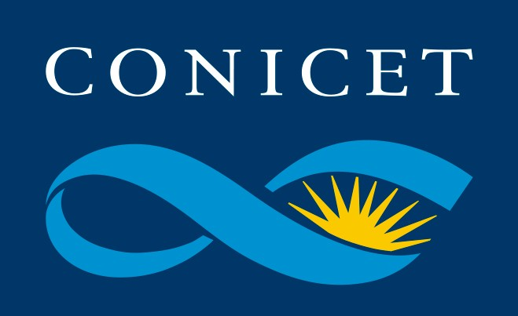
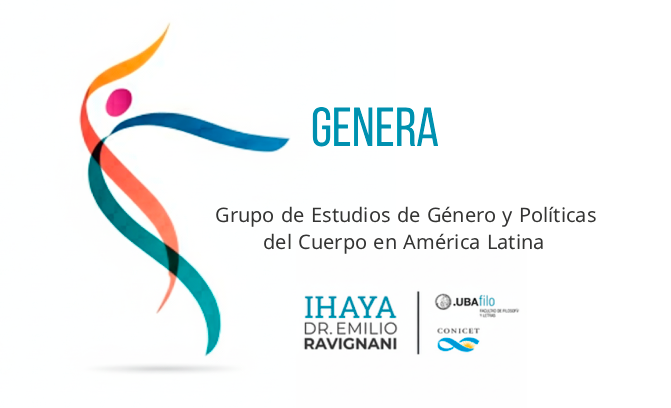
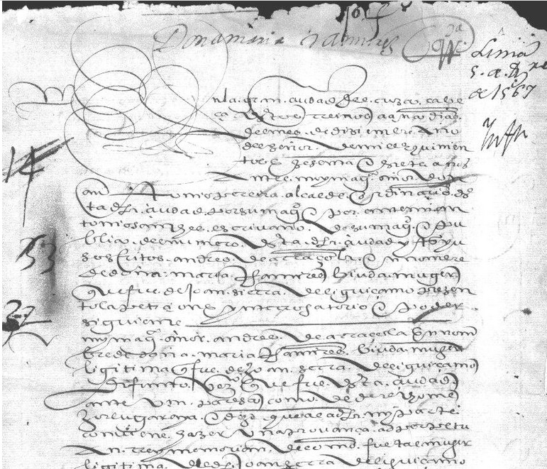
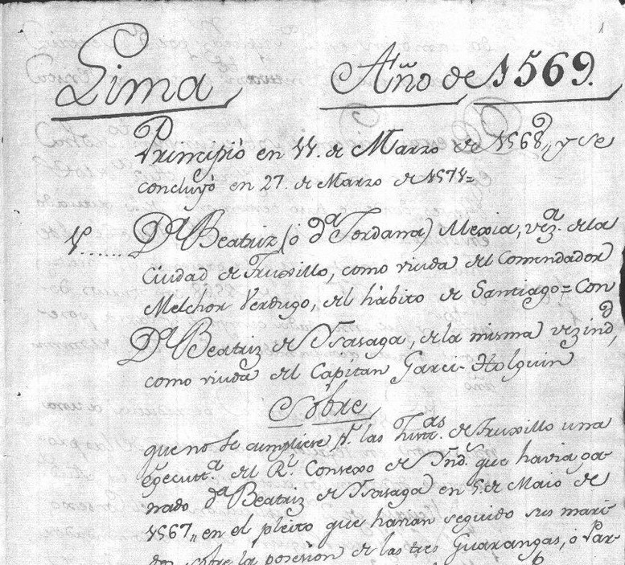
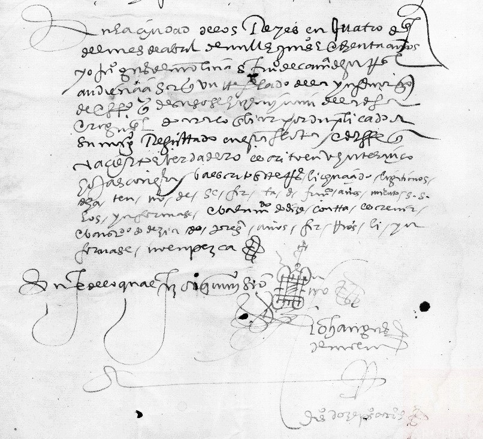
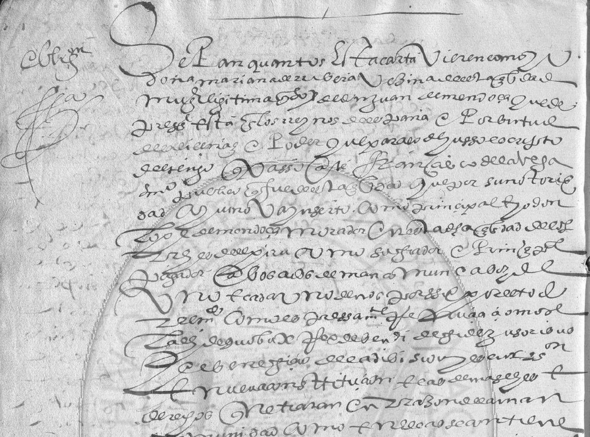

## Encomenderas, mediación y poder en el ámbito colonial andino (siglos XVI-XVII)

### De la microhistoria a la Historia Digital

##### [Romina De León](romideleon@gmail.com)

  
  

---

## 1. La paradoja estructural del poder femenino en el Virreinato del Perú

¿Cómo ejerce autoridad y administra poder una mujer que, dentro de la sociedad hispánica, ocupa **a la vez** una posición de subordinación y una de dominio?

- **Subordinadas:** bajo la tutela legal de padres, maridos o albaceas.
- **Dominantes:** controlaban el trabajo, el tributo y los cuerpos de pueblos encomendados y personas esclavizadas.

  

  <a href="https://upload.wikimedia.org/wikipedia/commons/0/04/Criollos-Espa%C3%B1oles_Per%C3%ACodo_Colonial_en_Am%C3%A9rica_(cropped)1.jpg" data-lightbox="docs"> 
    
    <em>Criollos y españoles en la sociedad estamental.   Dibujo de la crónica peruana de Felipe Guamán Poma de Ayala, siglo XVI.</em></a> 
  

  

  <a href="https://www.memoriachilena.gob.cl/602/articles-100512_thumbnail.jpg" data-lightbox="docs">
    
    <em>El corregidor de minas castiga cruelmente a los caciques principales.  Felipe Guamán Poma de Ayala (1615).</em></a>
  

---

## 2. Desde dónde miro y qué falta

- **Género y colonialidad**
- **Subordinadas, no subalternas**
- **Agencia situada** y **lectura a contrapelo**: ni anticolonial ni emancipatoria.
- **Lo que hay:** biografías y casos puntuales:
  - María Rostworowski
  - Liliana Pérez Miguel
  - Ana María Presta
  - Zambrano Cardona, entre otrxs.
  - Proyectos digitales descriptivos y espaciales.

**Vacío:** falta una mirada **relacional** sobre los vínculos de estas mujeres con pares, administración y poblaciones racializadas.

---

## 3. Problemas e hipótesis

**Pregunta directriz:**

- ¿Cómo ejerce autoridad quien ocupa simultáneamente una posición de subordinación y una de dominio?

Preguntas derivadas:

- ¿Qué relaciones se tejieron entre mujeres de distintas jerarquías y condiciones raciales?
- ¿Cómo influyó la religión en su agencia?

--

##### Hipótesis

Combinar lectura cercana y lectura distante permitirá superar la lógica de casos individuales y comprender como estas mujeres, desde su posición subordinada al orden social, económico y religioso hispánico, lograron, **en los márgenes y los intersticios** de esta sociedad, constituirse como **agentes estructurantes de poder político, económico y social**. Se buscará evidenciarlo, comprobando la coacción y administración en las poblaciones racializadas, originarios y esclavizados, a través de diversas fuentes.

---

## 4. Archivos y recorte

- Archivo General de las Indias (Probanzas de bienes y servicios; Testamentos, bienes de difuntos; Expedientes judiciales)
- Fondo Documental del Archivo General de la Nación del Perú - Archivo Histórico Digital del Archivo General de la Nación
- Archivo y Biblioteca Nacionales de Bolivia
- Censos (Aún no encontré y tampoco estoy segura si será relevante)
- Cartas y peticiones (Igual que el anterior)

**Recorte temporal y geográfico**
Siglos XVI y principios del XVII, núcleo andino (Audiencias de Lima y Charcas), con **proyección comparada hacia el sur del Virreinato** (Tucumán, Paraguay, Córdoba), donde la encomienda tuvo mutaciones.

--

##### Fragmentos del archivo colonial

  

  

  

  

  

---

## 5. Problemas metodológicos a resolver

- **Fuentes no digitalizadas**: Acervos clave (ej. AGN Bolivia) que requieren trabajo _in situ_.
- **Lectura paleográfica hermenéutica:** Dificultad técnica de la letra procesal encadenada y sesgo burocrático de la Corona.
- **Transcripción asistida (HTR)**, por ejemplo con Transkribus.
- **Herramientas computacionales:** Evaluar la arquitectura digital para el análisis macro de estas fuentes.

--

##### El cruce digital: Redes de vínculos y personajes

Siguiendo a Drucker, lo que se produce no es _data_ sino **_capta_**: datos construidos e interpretados.

**Historia digital, no solo historia por medios digitales** (Noiret): lo digital reescribe el método. **Minimal computing:** código abierto, bajo costo y formatos portables.

<iframe 
  src="https://hdlab.space/viaje-al-rio-de-la-plata/sigma-viz/index.html#%C3%81lvar%20N%C3%BA%C3%B1ez%20Cabeza%20de%20Vaca"
  width="100%"
  height="425"
  style="border: none; border-radius: 6px; margin-top: 20px;">
</iframe>

---

## 6. Mis voces veladas

#### Mi primer acercamiento: Elvira Manrique de Chaves

1591, Archivo General de Indias / Simancas. Información de méritos y servicios del general Ñuflo de Chaves y sus hijos (1580-1616). Viuda del gobernadorÑuflo de Chaves fundador de Santa Cruz de la Sierra en, quedó en una declarada necesidad extrema. Sin embargo, ejerció una activa triangulación legal, pues sus hijos Francisco y Álvaro, quienes también prestaron servicios a la Corona, y murieron sin descencia, continuaron las campañas militares, por ello, reclamó mercedes y rentas ante la Corona mediante mediadores varones (como el albacea Pedro de Voedo) para asegurar el sustento de su linaje femenino.

--

#### María Ramírez

1567, Archivo General de Indias. Sección: Gobierno. [1ª División] Audiencia de Lima. [Fracción de Serie-Unidad de Instalación] Informaciones de oficio y parte. También consta su marido, Juan Sierra de LeguizamoPodría tratarse del hijo de Mancio Sierra y de Doña Beatriz Coya

--

#### María Martel

Encomendera de los indios Laraos y Mancos. Constan también su padre Alonso Pérez Martel, su primer marido Francisco de Herrera, su segundo marido Hernando Martel de Mosquera y su hermano Bernardino Martel. Información contenida: 1574-1575, Archivo General de Indias, [Sección] Gobierno, [1ª División] Audiencia de Lima. [Fracción de Serie-Unidad de Instalación] Informaciones de oficio y parte.

--

#### Mariana de Ribera

1601, vecina de Lima, con poder de su esposo, encomendera en el pueblo de Magdalena y su fiador, se obligan pagar el cacique e indios del pueblo de Magdalena, cantidad de pesos, por especies varias que los indios les están obligados entregar tanto a ella como a Juan de Isásaga, por ser encomenderos de dicho pueblo.

--

#### Jordana Mejía

1568, Beatriz de Ysasaga, vecina de Trujillo, como viuda del capitán Garci Holguín, interpone ante el Consejo recurso de segunda suplicación de la sentencia dictada por la Audiencia de Lima en el pleito que contra ella ha seguido Jordana Mejía, de la misma vecindad, como viuda del Comendador Melchor Verdugo, de la Orden de Santiago, sobre el cumplimiento de una ejecutoria del Consejo, ganada por la citada Beatriz Ysasaga en el pleito que habían seguido los dichos sus maridos sobre la posesión de los indios de las parcialidades de Bambamarca, Pomamarca y el Chondal, en la provincia de Cajamarca.

--

#### Petronila de Castro

Encomienda heredada de su marido, Juan de Cianca. Luego contrae nupcias con Juan de Villanueva. En 1560 tiene una disputa con Pedro de Zárate, no puede acceder a las fuentes porque no están digitalizadas. Sin embargo para 1581 está casada con Pedro de Zárate. La disputa está en Escrituras Públicas del Arc. Nac. de Bolivia, La Plata 1560. 1581 Confirmación de la encomienda otorgada a Juan de VIllanueva.

---

## 7. Del caso a la red - Hacia el macroanálisis

La lectura cercana restituye la voz de una encomendera en un expediente. Para detectar **patrones en muchas encomiendas y vínculos** hace falta otra escala: lectura distante (Moretti) y macroanálisis (Jockers). Las máquinas leen a escala; la interpretación histórica sigue siendo humana.

Mediante la estructuración de _capta_ en TEI-XML, la transcripción asistida (HTR), si es que los modelos son efectivos, a través de un posterior análisis textual estadístico de datos en R/Python, que permitirán generar visualizaciones de grafos (Gephi / Sigma.js), proyecto modelar **una red más acabada de un corpus doctoral**.

Cada unos de estos nodos y aristas revelarán simultáneamente sus vínculos _hacia arriba_ (alianzas y mediadores judiciales) y _hacia abajo_ (administración coactiva de los pueblos originarios y esclavizados).

---

## 8. Conclusiones

- Leídas a contrapelo, se espera mostrar que las mujeres de la élite no solo participaron del sistema colonial, sino que **sostuvieron y reprodujeron** relaciones de dominación, negociando con la autoridad desde los márgenes.
- Una **lectura relacional y a escala** del poder femenino, que la historiografía de casos aislados no ha producido.
- La historia colonial en América del Sur puede recibir nuevas lecturas, porque no respuestas, sustentándose de la convergencia metodológica: **archivo + análisis de redes + Humanidades Digitales + microhistoria**.
